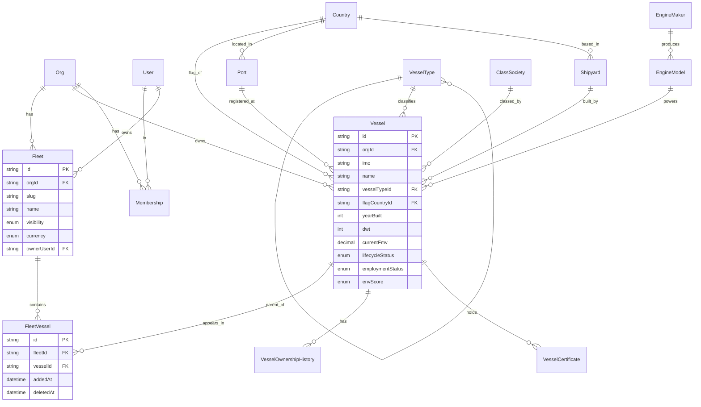

# Database architecture

This document is the source of truth for **how data is modelled** in the Signal S&P platform: the conventions every Prisma model follows, the relationship between org-scoped tables and platform-global reference tables, and the ER diagram showing how the Fleets & Vessels module fits together.

For the choice of database technology see [ADR-0001](../decisions/0001-prisma-postgres.md). For the unusual same-IMO rule see [ADR-0002](../decisions/0002-imo-not-globally-unique.md). For the reference-data strategy see [ADR-0003](../decisions/0003-reference-data-strategy.md).

## Conventions

### Three classes of table

| Class | Where | Examples | Lifecycle |
|---|---|---|---|
| **Identity & auth** | global, multi-tenant | `User`, `Account`, `Session`, `VerificationToken` | Hard delete only when a user is fully erased; soft delete (`deletedAt`) for normal removals. |
| **Org-scoped business data** | belongs to one `Org` | `Fleet`, `Vessel`, `FleetVessel`, `VesselOwnershipHistory`, `VesselCertificate` | Soft delete (`deletedAt`) by default. A Restore action reverses it. Hard delete is gated by a separate UI action with modal confirm. |
| **Platform-global reference data** | seeded, read-only for users | `Country`, `Port`, `VesselType`, `Shipyard`, `ClassSociety`, `EngineMaker`, `EngineModel`, `Counterparty` | Soft deactivation via `isActive = false`. Never hard-deleted — historical FKs stay valid. |

### Base columns

Every model carries these columns (snake_case in SQL, camelCase in Prisma):

| Column | Type | Purpose |
|---|---|---|
| `id` | `String` (CUID) | Primary key. CUIDs are URL-safe, time-ordered, and don't leak count information. |
| `createdAt` | `DateTime` | When the row was created. `@default(now())`. |
| `updatedAt` | `DateTime` | Auto-updated by Prisma on every write. |
| `deletedAt` | `DateTime?` | Soft-delete sentinel. `null` = active. Org-scoped tables and Fleet/Vessel join rows. |
| `isActive` | `Boolean` | Soft-deactivation flag for reference tables. Used instead of `deletedAt`. |

Org-scoped models also carry **`orgId`**. Queries always filter by it via repository helpers; cross-org access is impossible by construction.

### Money and dimensions

| Concern | Prisma type | Range |
|---|---|---|
| Currency amounts (FMV, acquisition cost, …) | `Decimal @db.Decimal(14, 2)` | Up to $999,999,999,999.99 — plenty of head-room for fleet portfolios. |
| Vessel dimensions (LOA, beam, draft, in metres) | `Decimal @db.Decimal(6, 2)` | Up to 9,999.99 metres. |
| Service speed (kn) | `Decimal @db.Decimal(4, 2)` | Up to 99.99 kn. |
| GPS coordinates | `Decimal @db.Decimal(8, 5)` | 5 decimal places ≈ 1.11 m precision. |

`Decimal` (not `Float`) for any number where rounding could matter — money, dimensions, financial ratios.

### Enums

Defined in Prisma, not stored as strings, so Postgres enforces validity at the type-system level:

- `Role` — OWNER / ADMIN / MEMBER / VIEWER
- `Currency` — USD / EUR / GBP / JPY / CNY
- `FleetVisibility` — PRIVATE / TEAM / READ_ONLY
- `VesselLifecycleStatus` — ACTIVE / LAID_UP / DRYDOCK / SOLD / SCRAPPED
- `EmploymentStatus` — TC / SPOT / IDLE / DRYDOCK / UNDER_REPAIR
- `EnvScore` — A / B / C / D / E
- `CounterpartyType` — CHARTERER / BUYER / SELLER / LENDER / BROKER / MANAGER / OPERATOR
- `PendingReferenceTable`, `PendingReferenceStatus` — for the admin review queue

When adding a value to an existing enum, write a migration that `ALTER TYPE … ADD VALUE`. Removing a value is a breaking change and needs a multi-step migration.

### Indexes

Every foreign key has an index. Composite indexes mirror common query shapes:

- `(orgId, deletedAt)` on org-scoped tables → fast "active rows for this org" queries
- `(orgId, vesselTypeId)` on `vessels` → segment filters on the fleet table
- `(fleetId, deletedAt)` on `fleet_vessels` → "vessels currently in this fleet"
- `(status, table)` on `pending_reference_suggestions` → admin queue browsing
- `(action, createdAt)` on `audit_logs` → activity feeds

`@@unique` constraints encode business rules — see ADR-0002 for the `(orgId, imo, name)` choice on `vessels`.

## ER diagram — Fleets & Vessels module

Solid lines = mandatory FKs. Optional FKs (Shipyard, ClassSociety, EngineModel, PortOfRegistry, FlagCountry) are nullable on `Vessel` — only Org and VesselType are required.

## Reference data — scope and "Other" fallback

Reference rows are owned by the platform team and seeded by `prisma/seed.ts`. Customer admins cannot edit them from the UI. Each consuming form field provides an **"Other"** option; when chosen, the form writes:

- `null` into the FK column on the consuming row (e.g. `Vessel.shipyardId`)
- the user's free-text value into a dedicated `*Other` column (e.g. `Vessel.shipyardOther`)
- a row into `pending_reference_suggestions` capturing the suggestion, the user/org who made it, and any contextual data

A future admin screen lets the platform team review each suggestion and either merge it (creates a real reference row, optionally re-links matching `*Other` values) or reject it. Until that screen ships, suggestions accumulate but don't get merged.

See [ADR-0003](../decisions/0003-reference-data-strategy.md) for the full rationale.

## Soft delete + Restore + Hard delete

Org-scoped data uses three operations:

| Operation | What it does | UI placement |
|---|---|---|
| **Soft delete** (`deletedAt = now()`) | Row hidden from default queries but preserved. Other rows referencing it stay valid. | Default action (the "Delete" button on most rows). |
| **Restore** (`deletedAt = null`) | Brings a soft-deleted row back. | A button in the "Deleted *X*" screen — `/fleetspace/deleted`, `/vessels/deleted`, etc. |
| **Hard delete** (`DELETE FROM …`) | Removes the row permanently. Cascades to dependent rows where the FK has `onDelete: Cascade`. | A separate, explicitly labelled button behind a modal confirmation. Only available from the "Deleted *X*" screen. |

Repository helpers `findManyActive(...)`, `findManyDeleted(...)`, `softDelete(id)`, `restore(id)`, `hardDelete(id)` codify this so feature code never has to remember the pattern.

## Migrations

- **Local development:** `docker compose exec so-snp-web pnpm db:migrate` — runs `prisma migrate dev`. Prompts for a name on first run; subsequent migrations auto-name.
- **CI / production:** `pnpm db:migrate:deploy` — applies committed migrations only, never generates new ones.
- **Reset (destructive):** `docker compose exec so-snp-web pnpm db:reset` — drops and recreates the database, then re-seeds. Use during development when the schema diverges; never on a database with real data.

Every migration is reviewed in the PR that generates it. The migration name should reflect the change (e.g. `add_fleet_and_vessel_tables`).

## Test database

The CI workflow spins up Postgres 16 as a service container and runs migrations against a fresh `snp_test` database. Locally, the same `so-snp-db` container is used for both dev and tests — repository tests wrap their work in a transaction that's rolled back at the end of each test, so no test data persists.

See [`testing-strategy.md`](./testing-strategy.md) for the full test layering.

## See also

- [ADR-0001](../decisions/0001-prisma-postgres.md) — Why Prisma + Postgres
- [ADR-0002](../decisions/0002-imo-not-globally-unique.md) — `(orgId, imo, name)` unique on Vessel
- [ADR-0003](../decisions/0003-reference-data-strategy.md) — Platform-global reference data with "Other" fallback
- `web/prisma/schema.prisma` — the schema itself
